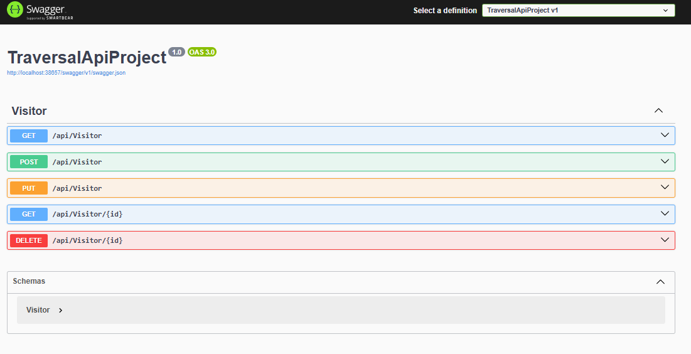
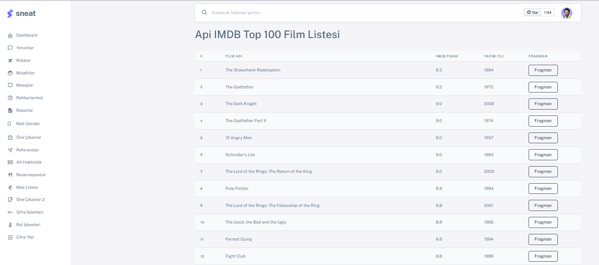
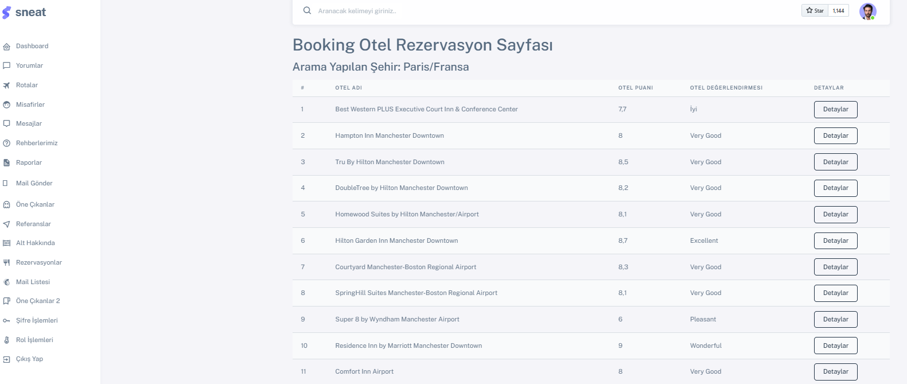
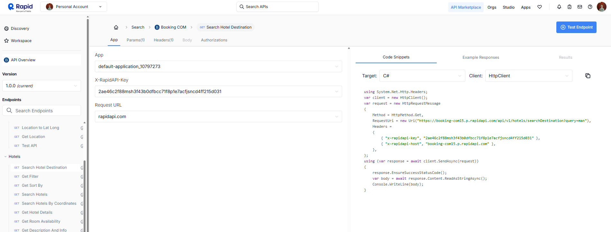

# 🌐 TraversalApiProject

TraversalApiProject is a dedicated **RESTful API service layer** designed to support and extend the capabilities of the [TraversalCoreProject](https://github.com/mrvekratl/TraversalCoreProject), a full-stack reservation platform.

This API was created as part of a comprehensive software engineering training initiative. The goal was to **explore modular service architecture**, **consume and expose APIs**, and **simulate real-world data exchange** using modern .NET backend practices.

---

## 🛠️ Screenshots

---

## 🎯 Purpose of the Project

The TraversalApiProject was built with the following core objectives:

- 🧩 **Modular Backend Design**  
  Separate the data access and business logic into a decoupled API that serves multiple frontends.

- 🔗 **Live API Communication**  
  Integrate external APIs using RapidAPI and `HttpClientFactory` to simulate dynamic, real-world data.

- 📡 **Cross-Project Data Sharing**  
  Enable the main MVC project (TraversalCoreProject) to consume and visualize data from this API via services.

---

## 🧠 Practical Scenarios Covered

This project goes beyond simply exposing CRUD endpoints. It served as a learning platform to experiment with diverse real-life backend scenarios:

### ✅ API Production

- Created REST endpoints for Destinations, Reservations, and Visitors
- Used DTOs and AutoMapper to structure and decouple request/response models
- Applied best practices in controller/service/repository layering
- Practiced versioning, validation, and modular architecture

### ✅ API Consumption

- Consumed the API from the TraversalCoreProject via service injection
- Visualized dynamic visitor statistics using data fetched from the API
- Enabled frontend dashboards to remain clean and data-driven

### 🌍 External API Integration

- Integrated with **IMDB Film API** using RapidAPI to pull top-rated movie data
- Implemented a dynamic **hotel listing feature** by querying Booking.com’s public API, filtered by rating and location
- Practiced deserialization, API key management, rate-limiting control, and live service testing

> This expanded the project’s scope from basic internal APIs to **real-world service-oriented communication**.

---

## 🛠️ Tech Stack

- **C#**, **ASP.NET Core Web API**
- **Entity Framework Core** – Code First
- **PostgreSQL** & **SQL Server** support
- **Swagger UI** – for live testing
- **HttpClientFactory** – external API consumption
- **AutoMapper**, **DTO Structure**, **SOLID Principles**

---

## 🔗 Integration with TraversalCoreProject

This API is fully integrated with the [TraversalCoreProject](https://github.com/mrvekratl/TraversalCoreProject).  
The front-facing application uses this service to:

- Fetch and display destination & reservation data
- Populate admin dashboards with real-time statistics
- Show external data such as weather or hotel info from third-party APIs

This design promotes **separation of concerns**, **reusability**, and **scalability**, closely mimicking enterprise-grade architecture.

---

## 💡 What I Learned

- 📐 How to design and document APIs that are **frontend-consumable**
- 🧩 Working with **modular, scalable service structures**
- 🌐 Using **HttpClient** and **external APIs** in production-level code
- 📦 Packaging data using DTOs and keeping architecture clean and reusable
- 🧪 Validating and testing endpoints using Swagger & Postman

This was not just a tutorial exercise — it was an exploration of **how APIs are built, consumed, and extended**.

---

## 🙌 Special Thanks

Gratitude to [Murat Yücedağ](https://www.youtube.com/playlist?list=PLKnjBHu2xXNMK5MBogdXmsXVi3K_eEZT5), whose 100-part training series enabled this project. His practical and real-world approach to backend development made it possible to work through production-level challenges confidently.

---

## 💼 For Recruiters

This repository reflects my skills in:

- ✅ Designing maintainable REST APIs
- ✅ Building real-world, modular, and scalable backend systems
- ✅ Integrating third-party data through API consumption
- ✅ Bridging projects for enterprise-level communication

If you’re seeking a backend developer with hands-on experience, architectural thinking, and a passion for continuous learning — **let’s connect!**

🔗 [LinkedIn](https://www.linkedin.com/in/merve-kiratli-0b049a187/)

